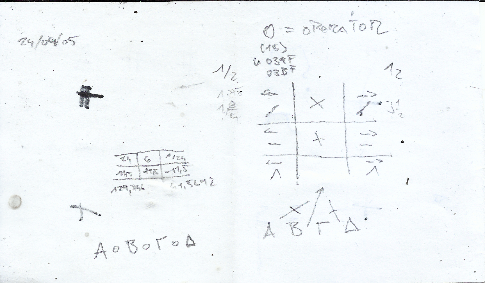

# Welcome to Kof's abstract math crash course!



## Greekset

It uses 24 letters of Greek alphabet representing numbers from 1..24

where `A = 1, B = 2, Γ = 3 and Δ = 4`


## Special Operator = Omicron (better symbol yet to come)

Operator Omicron stands for variable in mathematical operator symbol.

Omicron can be either "+", "−", "×", "÷" ...etc. the variable is for the operation itself:

o = any operation:

```
aοbοcοd = ...
```

..please notice that, while having fun all numbers are still pretty, and so on


## What the program does

`omicron` takes the first N numerals — `a = 1`, `b = 2`, ..., up to `z = 26` —
and substitutes every possible combination of Omicrons between them:

```
a ο b ο ... ο z
```

Each gap holds one of four operations (`+ − × ÷`), so N letters give
`4^(N-1)` expressions, evaluated strictly left-to-right.
For example, with `-n 4` there are exactly `4³ = 64` of them:

```
$ ./build/omicron -n 4
a + b + c + d = 10
a + b + c − d = 2
a + b + c × d = 24
...
```

Run without arguments you get all 26 letters: `4²⁵ ≈ 1.1 quadrillion`
expressions — too many to print, so the program says so instead and hints
at `-n`, `--force` or reverse mode.

### Reverse mode

Given a target number, omicron searches through the whole space of
expressions and reports every combination of operators that produces it.
Interval pruning discards prefixes that can no longer reach the target,
so even the full a..z space is searched in an instant:

```
$ ./build/omicron --reverse 24 -n 4
a + b + c × d = 24
a × b × c × d = 24
```

Use `--limit K` (default 1000) to cap the number of matches reported.

### Options

```
-n N           use letters a..(a+N-1), 1..26; default: a..z
--reverse R    list expressions that evaluate to R (left-to-right)
--limit K      max matches reported in reverse mode; default 1000
--force        allow printing more than one million expressions
```


## Build & run

```
make            # builds build/omicron
make test       # runs self-checks
./build/omicron -n 4            # enumerate all a..d expressions
./build/omicron --reverse 24    # find a..z expressions equal to 24
```
